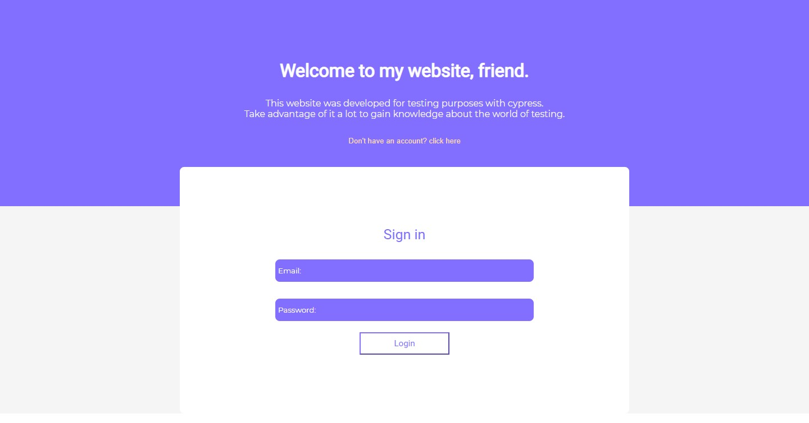
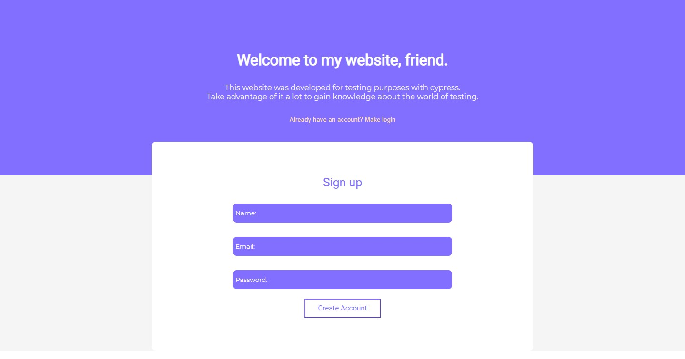
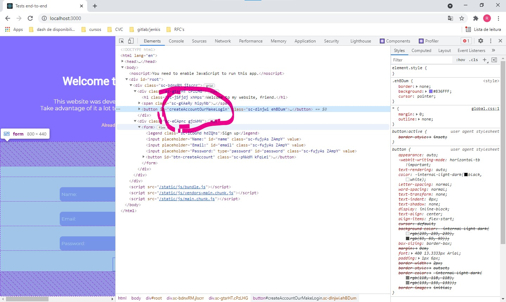
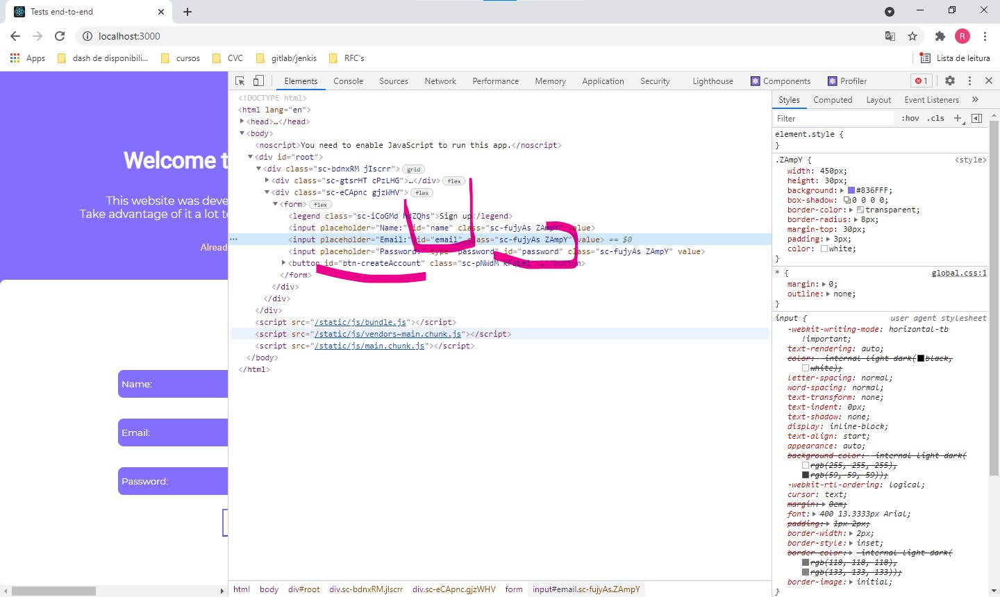
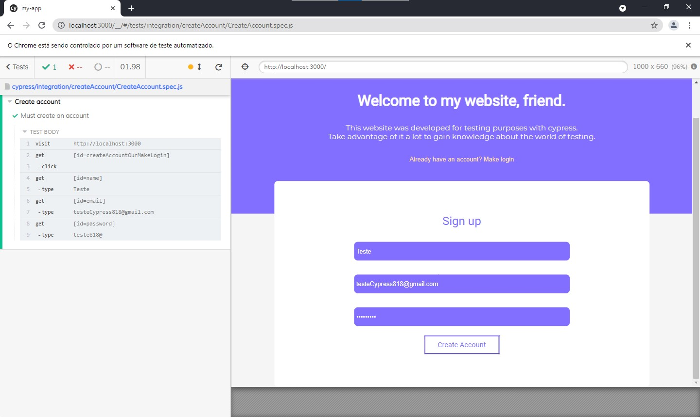
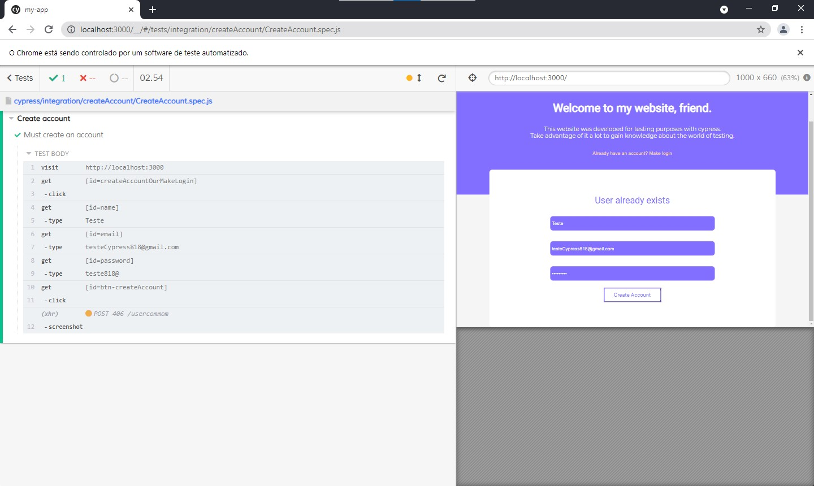

# Sobre o Projeto:

Esse projeto é focado em testes end-to-end com o cypress, a aplicação em si é apenas um exemplo de como podemos testar nossos códigos de uma forma em que nossos sites possam garantir uma experiência de usuário agradável sem erros inesperados. A aplicação trata-se de um login e upload de arquivos.


**OBS:**
Nesse primeiro artigo irei explicar os testes com o login, no segundo artigo já teremos a página de upload e os testes nela.

# Imagens do projeto: 






**Para iniciar o projeto:**

```
npm install ou yarn add
npm start
```

**Esse projeto possui o consumo de uma api, aqui está o link para você baixar o código: ```https://github.com/Rfontt/Challenge```, lá eu deixei uma documentação de como ela funciona.**

# Rotas:

O login e a criação de conta estão na rota ```Home```, ela é uma página pública que todos podem acessar. Esse projeto conta com uma segurança nas rotas, a qual só permite que um usuário acesse uma determinada rota se ele estiver logado(nesse caso com um token setado no localStorage).

**OBS:**
Esse projeto segue uma arquitetura limpa e de fácil manunteção, no momento ele está em progresso, mas vale lembrar que devemos sempre manter um código limpo até mesmo em projetos que não vão para produção :)
Além disso, temos um termo principal que o define: segurança. Segurança nas rotas e segurança na experiência do usuário.

# Iniciando com o cypress

```
npm install cypress -D our yarn add crypress -D
```

Você vai usar o seguinte comando para iniciar o cypress:

```
./node_modules/.bin/cypress open ou npx cypress open
```
Para ficar melhor para nós na execução dos testes, vamos criar um script no ```package.json```:

```
scripts": {
    "start": "react-scripts start",
    "build": "react-scripts build",
    "test": "npx cypress open",
    "eject": "react-scripts eject"
}
```

Esse comando cria a estrutura de pastas e quando essa estrutura estiver criada ele abre o cypress.

# Arquitetura do projeto.

Quando geramos a pasta ```cypress```, temos bastante exemplo que vem da própria lib, esses exemplos vem em pastas que o próprio cypress disponibiliza. A pasta que mais nos interessa é a ```integration```, pois é nela que vamos construir nossos testes. Então você pode apagar todos os exemplos que estão dentro dela para podermos criar nossa arquitetura a partir daqui.

### A estrutura do nosso projeto até o momento ficará assim:

- integration
  - createAccount
    - CreateAccount.spec.js
  - login
    - Login.spec.js

# Pasta cypress/integration/createAccount:

Agora iremos partir, enfim, para o código. Para iniciarmos crie um arquivo dentro da pasta de createAccount nomeado como ```CreateAccount.spec.js```

Dentro dele vamos fazer nosso primeiro comando, o qual é a referência do cypress para que possamos ter o Cypress IntelliSense no VSCODE.

```
/// <reference types="cypress" />
```

Feito isso podemos iniciar com os testes em si, agora nós precisamos englobar nossos testes dentro de um describe. No seu primeiro parâmetro vamos especificar o que iremos fazer nesse teste e no segundo ele recebe uma função que irá executar os testes unitários. Esses testes unitários, tbm receberam parâmetros, o primeiro descreve o que ele irá executar e o segundo receber uma função que têm os passos a passos do que ele deve fazer, eles serão nomeados como **"it"**.

```
describe("Create account", () => {
    it("Must create an account", () => {
        
    })
})
```

**Estou dizendo ao describe que a função global irá "Criar uma conta" e no it digo que ele "deve criar uma conta", para deixarmos claro que ele deve executar isso em sua função.**

Agora sim vamos para a execução do teste, para iniciar precisamos conhecer alguns métodos que o cypress possui

- visit: Serve para indicarmos a URL que iremos visitar.
- get: Serve para para pegarmos algum elemento html que possui uma indentificação e assim realizarmos ações nele.

Vamos chamar esses métodos através do comando ```cy```.

### Observações iniciais:

Você provavelmente irá receber um erro quando tentar fazer qualquer código utilizando o ```cy```, para resolver isso faça o seguinte:

- Crie na raiz do projeto uma arquivo nomeado como: ```.eslintrc.json```
- Nele coloque os seguintes comandos:

```
{
    "extends": [
        "plugin:cypress/recommended"
    ]
}
```

**Com isso feito vamos ao primeiro passo: visitar nosso site.**

```
describe("Create account", () => {
    it("Must create an account", () => {
        cy.visit('http://localhost:3000');
    })
})
```

No código acima estamos usando o método **visit** para visitarmos o nosso site que possui a URL ```http://localhost:3000```, pois está no ambiente local.

Agora vamos começar a usar o ```get``` para manipularmos o os elementos do nosso site. O principal elemento que precisamos manipular é o button de criar um conta e em segundo o input, pois para criarmos uma conta devemos específicar nossos dados.

Primeiro precisamos clicar  no button de criar uma conta, se você inspecionar o projeto verá que esse button possui um id e é por ele que iremos nos basear.



Agora podemos fazer o comando que clica nele:

```
describe("Create account", () => {
    it("Must create an account", () => {
        cy.visit('http://localhost:3000');

        cy.get('[id=createAccountOurMakeLogin]').click();
    })
})
```

Nesse código passamos para o get o id com o seu valor. Além disso, vemos um método novo: o click. Basicamente, o click nos diz que irá clicar aonde estamos pedido, ou seja, no lugar que possui o id que passamos a ele.

**Próximo passo**

Inspecionando novamente o projeto você verá que os inputs também possuem um id e isso vai nos ajudar para que possamos passar para o testes alguns dados de entrada. São eles: name, email, password.



Agora iremos conhecer um novo método: o type. Esse método irá receber de parâmetro os dados que queremos colocar no input, o código ficará assim:

```
describe("Create account", () => {
    it("Must create an account", () => {
        cy.visit('http://localhost:3000');

        cy.get('[id=createAccountOurMakeLogin]').click();
        cy.get('[id=name]').type('Teste');
    })
})
```

**Sim, é exatamente isso que você está vendo na sua tela, o input está recebendo um valor sem você digitar nada, que legal não é mesmo? Isso se chama AUTOMATIZAÇÃO**

Vamos fazer isso para os demais input? Let's go.

```
describe("Create account", () => {
    it("Must create an account", () => {
        cy.visit('http://localhost:3000');

        cy.get('[id=createAccountOurMakeLogin]').click();
        cy.get('[id=name]').type('Teste');
        cy.get('[id=email]').type('testeCypress818@gmail.com');
        cy.get('[id=password]').type('teste818@');
    })
})
```

**Até o momento nossos testes estão assim:**



Agora só precisamos clicar no button e realizaremos nosso cadastro:

```
describe("Create account", () => {
    it("Must create an account", () => {
        cy.visit('http://localhost:3000');

        cy.get('[id=createAccountOurMakeLogin]').click();
        cy.get('[id=name]').type('Teste');
        cy.get('[id=email]').type('testeCypress818@gmail.com');
        cy.get('[id=password]').type('teste818@');
        cy.get('[id=btn-createAccount]').click();

        cy.screenshot();
    })
})
```

No final desse código estou pedindo para que realize um screenshot da tela :) QUE PODER TEM O CYPRESS, NÃO É MESMO?

**Veja na pasta de screenshot que o cypress cria após realizar o print da tela**

Se tudo ocorrer como a api espera você receberá o seguinte aviso na tela:


Se você tentar criar de novo o usuário receberá o seguinte:



### Então finalizamos a criação da conta, vamos logar?

# Pasta cypress/integration/login:

Para iniciarmos crie um arquivo dentro da pasta de login nomeado como ```Login.spec.js```

A partir daqui iremos fazer as mesmas coisas que fizemos ao criar uma conta, então tente fazer sozinho e veja se consegue, a baixo irei deixar o código final :) 

```
/// <reference types="cypress" />

describe("Make login", () => {
    it("Must make login", () => {
        cy.visit('http://localhost:3000');

        cy.get('[id=email]').type('testeCypress818@gmail.com');
        cy.get('[id=password]').type('teste818@');

        cy.get('[id=btn-login]').click();
    })
})
```

Veja que fizemos bem menos que no anterior, pois não precisamos clicar em um button inicial e o login possui só dois inputs. Se você fez certo irá ser redirecionado para uma página que apenas quem possui um token de autenticação tem acesso.

**Projeto em contrução...**